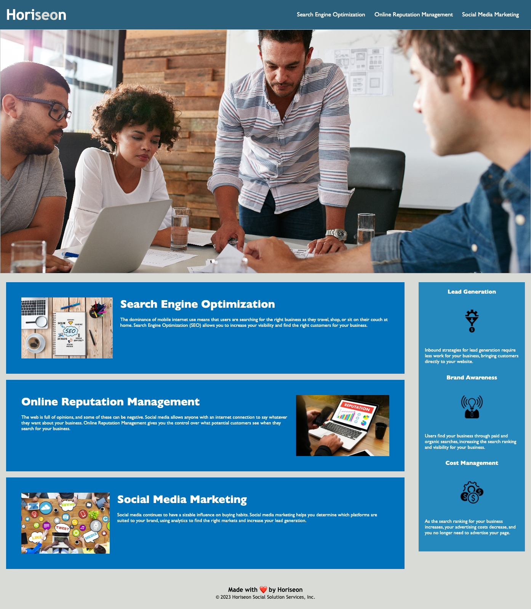

# Horiseon Website Made Accessible

## Description
To make the exisiting code meet accessibility standards, I modified the exisiting code to be structured for search engines.

## Acceptance Criteria
- I made the webpage meet the accessibility standards
- To do so I added semantic HTML elements to the website
- After looking at the structure of the HTML elements I found a logical structure of styling and positioning 
- I made sure that the icon and image elements are able to be seen
- I then found accessible alt attributes
- I made sure that the heading attributes are in sequential order
- I added a creative title regarding the webpage 
- On the Style CSS sheet I consolidated the properties and organized the structure.
- I commented on the CSS on where I made changes.

## Site Screenshot 

## Link to Deployed Attributes 
- [Horiseon Website](https://hjenp22.github.io/HW01-Horiseon-Website-Made-Accessible/)

## About the Author
- Email: hjipark22@gmail.com
- Github: hjenp22